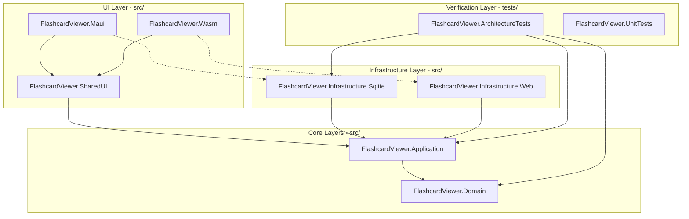

# T-200-ARCH Clean Architecture and Blazor Multi-Platform Migration Plan

**Status:** In Progress
**Priority:** P0
**Related Bug:** N/A
**Related Plans:** N/A

---

## 1. Problem Statement

The current FlashcardViewer project is structured as a single monolithic .NET MAUI application targeting `.net10.0`. Its UI is defined entirely in MAUI XAML (`.xaml` and `.xaml.cs` views paired with MVVM view models), which restricts deployment exclusively to platforms supported by MAUI native client runtimes (Windows, Android, MacCatalyst). 

There is currently no pathway to run FlashcardViewer inside web browsers as a static web application. Furthermore, the application lacks clear architectural boundaries, making it difficult to write decoupled tests or prevent UI/Framework concerns from leaking into domain entity and data storage rules.

## 2. Goals

1. **Decouple Core Business Rules**: Isolate domain entities and core application logic from UI and database frameworks.
2. **Enable Web Browser Support**: Structure the UI using Razor components (`.razor`) and CSS so it can be hosted in both Blazor WebAssembly (for the web) and Blazor Hybrid (for native desktop/mobile wrappers).
3. **Establish Data Access Abstractions**: Decouple the SQLite persistence engine so that native platforms run direct local filesystem I/O, while sandboxed web browsers fallback to IndexedDB or Local Storage.
4. **Programmatic Architecture Enforcement**: Introduce automated architecture tests that fail compilation if cross-boundary dependencies are introduced (e.g., Domain referencing Application, or Application referencing UI).
5. **No Code Loss**: Preserve all existing feature functionality (Flashcard management, sets, session configurations, theme support).

## 3. Non-Goals

1. Do not port the application to .NET 11 (remain pinned to the `.net10.0` environment).
2. Do not rewrite UI logic to use WinUI XAML, Uno Platform, or Avalonia.
3. Do not modify the existing SQLite data schema or raw asset contents.
4. Do not target iOS in this plan (keep platform support matrix identical to the pre-migration state: Windows, Android, MacCatalyst, and Web).

## 4. Architecture Decision

Decouple the application using a Clean Architecture design pattern with dependency-inversion boundaries. The target projects and dependencies are structured as follows:

* **Core Domain and Application**: Contains entities, value objects, use cases, and interfaces. This project contains zero references to MAUI, Blazor, SQL, or web components.
* **Shared UI (Razor Class Library)**: Hosts all shared pages (`.razor`) and static assets (CSS, images). Views communicate with the `Application` layer via states or commands.
* **Platform Hosts**: `FlashcardViewer.Maui` and `FlashcardViewer.Wasm` act as thin execution shells. They register platform-specific infrastructure implementations (SQLite vs Web LocalStorage) in the dependency injection container and host the Shared UI root component.

All core source code projects must be located under the `src/` directory at the project root. All validation and testing projects must be located under the `tests/` directory at the project root.

### Testing Standard: TUnit and Code Coverage
To guarantee stability and prevent regressions across multiple runtime targets, all projects must target high test coverage:
* **Test Framework**: Use **TUnit** as the primary testing framework for unit, integration, and architecture tests.
* **Slice Delivery Requirement**: Every slice task includes the requirement to write corresponding tests concurrently with implementation. Slices are not complete until coverage verification passes.

---

## 5. Planned Slices

### Slice 1: Domain and Application Setup

- [x] **T-200a1 (P0): Domain Project Setup & Code Migration**
  - **Goal:** Set up the domain core library and migrate domain models.
  - **DoD:**
    1. Create class library `FlashcardViewer.Domain` (`net10.0`) under `src/`.
    2. Migrate entities (`Flashcard`, `FlashcardSet`, `SessionConfig`) from the current project to `FlashcardViewer.Domain`.
    3. Write comprehensive TUnit unit tests validating validation limits and state transitions of the domain entities in `tests/FlashcardViewer.UnitTests`.
  - **Artifacts:** `src/FlashcardViewer.Domain/`, `tests/FlashcardViewer.UnitTests/`.

- [x] **T-200a2 (P0): Application Project, Interface Boundaries & Architecture Tests**
  - **Goal:** Define abstract interfaces, use cases, and establish structural dependency checks.
  - **DoD:**
    1. Create class library `FlashcardViewer.Application` (`net10.0`) in `src/` referencing `Domain`.
    2. Declare repository interfaces (`IFlashcardRepository`, `IDatabaseInitializer`) in `Application`.
    3. Create `FlashcardViewer.ArchitectureTests` (`net10.0`) test project under `tests/` using the TUnit framework.
    4. Write architecture boundary rules (e.g. `Domain` cannot import outside files, infrastructure cannot leak references) and execute successfully.
  - **Artifacts:** `src/FlashcardViewer.Application/`, `tests/FlashcardViewer.ArchitectureTests/`.

---

### Slice 2: Persistence and Data Access

- [x] **T-200b1 (P0): SQLite Infrastructure & Persistence Tests**
  - **Goal:** Decouple native filesystem storage into an isolated project.
  - **DoD:**
    1. Create class library `FlashcardViewer.Infrastructure.Sqlite` (`net10.0`) under `src/`.
    2. Move SQLite connection configuration and DB migrations to `Infrastructure.Sqlite`.
    3. Write integration tests using TUnit with in-memory database engines confirming schema setup, reads, and writes.
  - **Artifacts:** `src/FlashcardViewer.Infrastructure.Sqlite/`.

- [x] **T-200b2 (P0): Web Infrastructure & Web Test Coverage**
  - **Goal:** Implement storage rules compatible with browser sandbox environments.
  - **DoD:**
    1. Create class library `FlashcardViewer.Infrastructure.Web` (`net10.0`) under `src/`.
    2. Implement repository interfaces using browser LocalStorage or IndexedDB fallback.
    3. Write TUnit unit tests with mocked browser state APIs to verify browser persistence bounds.
  - **Artifacts:** `src/FlashcardViewer.Infrastructure.Web/`.

---

### Slice 3: Shared Razor Components

- [ ] **T-200c1 (P0): Shared UI Structure, CSS Tokens & Layout Setup**
  - **Goal:** Set up the shared Razor Class Library base framework and styles.
  - **DoD:**
    1. Create Razor Class Library `FlashcardViewer.SharedUI` (`net10.0`) under `src/`.
    2. Establish a responsive layout shell (`MainLayout.razor`) and styling variables in `wwwroot/app.css` (themes, transitions).
  - **Artifacts:** `src/FlashcardViewer.SharedUI/`.

- [ ] **T-200c2 (P0): Set List View Porting**
  - **Goal:** Port the set list view page to a shared Razor Component.
  - **DoD:**
    1. Port XAML `FlashcardSetListPage` $\rightarrow$ Razor component `FlashcardSetList.razor`.
    2. Hook up component bindings to `Application` storage services.
    3. Write TUnit component render verification tests.
  - **Artifacts:** Razor views and tests in `src/FlashcardViewer.SharedUI/`.

- [ ] **T-200c3 (P0): Card List View Porting**
  - **Goal:** Port card details display view.
  - **DoD:**
    1. Port XAML `FlashcardListPage` $\rightarrow$ Razor component `FlashcardList.razor`.
    2. Write TUnit verification tests.
  - **Artifacts:** Razor views and tests in `src/FlashcardViewer.SharedUI/`.

- [ ] **T-200c4 (P0): Flashcard Session View Porting**
  - **Goal:** Port the interactive evaluation session page.
  - **DoD:**
    1. Port XAML `FlashcardSessionPage` $\rightarrow$ Razor component `FlashcardSession.razor`.
    2. Write CSS transitions for high-performance visual card flipping.
    3. Write TUnit verification tests.
  - **Artifacts:** Razor views and tests in `src/FlashcardViewer.SharedUI/`.

- [ ] **T-200c5 (P0): Session Configuration Popup Porting**
  - **Goal:** Port the configuration settings dialog overlay.
  - **DoD:**
    1. Port XAML `SessionConfigManagementPopup` $\rightarrow$ Razor component `SessionConfigPopup.razor`.
    2. Write TUnit verification tests.
  - **Artifacts:** Razor views and tests in `src/FlashcardViewer.SharedUI/`.

---

### Slice 4: Shell Hosts Bootstrapping

- [ ] **T-200d1 (P0): MAUI Host Bootstrapping & Windows Verification**
  - **Goal:** Set up native wrapper execution on Windows desktop.
  - **DoD:**
    1. Relactor current `FlashcardViewer` project to act as native host `FlashcardViewer.Maui` (`net10.0`) under `src/`.
    2. Mount shared UI in `MainPage.xaml` inside a `<BlazorWebView>`.
    3. Wire DI for `Infrastructure.Sqlite` in `MauiProgram.cs`.
    4. Compile and verify app executes successfully on Windows.
  - **Artifacts:** `src/FlashcardViewer.Maui/`.

- [ ] **T-200d2 (P0): WebAssembly Host Bootstrapping & Browser Verification**
  - **Goal:** Set up browser web client compilation.
  - **DoD:**
    1. Create Blazor WebAssembly project `FlashcardViewer.Wasm` (`net10.0`) under `src/`.
    2. Wire DI for `Infrastructure.Web` in `Program.cs`.
    3. Compile and verify the application runs successfully in a local browser.
  - **Artifacts:** `src/FlashcardViewer.Wasm/`.

---

### Slice 5: Pipelines and Workflows

- [ ] **T-200e1 (P1): Continuous Integration (CI) Workflow**
  - **Goal:** Setup automatic test and compilation checks.
  - **DoD:**
    1. Create `.github/workflows/ci.yml` file.
    2. Verify builds and executes TUnit validations automatically.
  - **Artifacts:** `.github/workflows/ci.yml`.

- [ ] **T-200e2 (P1): Deployment (CD) Workflow**
  - **Goal:** Configure automated releases.
  - **DoD:**
    1. Create `.github/workflows/deploy.yml` configuring builds for Windows MSIX, Android APK, and Blazor WebAssembly static build page exports.
  - **Artifacts:** `.github/workflows/deploy.yml`.

---

## 6. Verification

1. **Architecture Test**: Passing assembly scan verifying Domain, Application, and Infrastructure boundaries are preserved.
2. **Persistence Test**: SQLite repositories write/read test data correctly.
3. **Execution Verification (Desktop)**: Executing `dotnet run -f net10.0-windows10.0.26100.0` in `src/FlashcardViewer.Maui` starts the application, initializes the DB, and shows the UI.
4. **Execution Verification (Web)**: Executing `dotnet run` in `src/FlashcardViewer.Wasm` opens the client app in a local browser port and fully loads/edits card sets.
5. **Formatting Validation**: Running `powershell -File tests/format-check.ps1` returns 0 exits (verifying `.cs` files end with exactly one newline, while `.csproj` and `.slnx` end with zero).

## 7. Fallout And Coordination

1. Porting ViewModels to Web-compatible state handlers must not alter the core execution rules of flashcard session calculations.
2. When creating the Shared UI project, CSS components should avoid TailwindCSS and stick to Vanilla CSS matching current styling elements to ensure maximum flexibility and direct transition control.
3. Central Package Management (CPM) configurations in the parent directory must be verified so they do not conflict with the isolated project files.
4. All agents must follow the code format constraints mandated by the root `.editorconfig`. Running `powershell -File tests/format-check.ps1 -Fix` automatically resolves formatting discrepancies.

## 8. Open Questions

1. Should the IndexedDB storage layer synchronize card changes back to an external web service, or remain local-only?
2. Are there any custom SVG assets or fonts in the native platform folders that need to be migrated to the shared web assembly environment?
